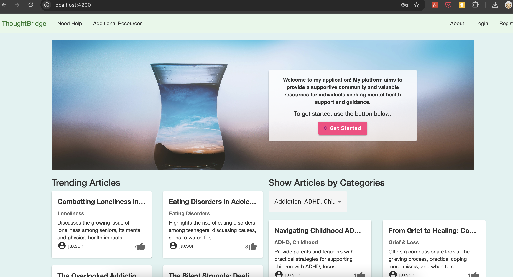
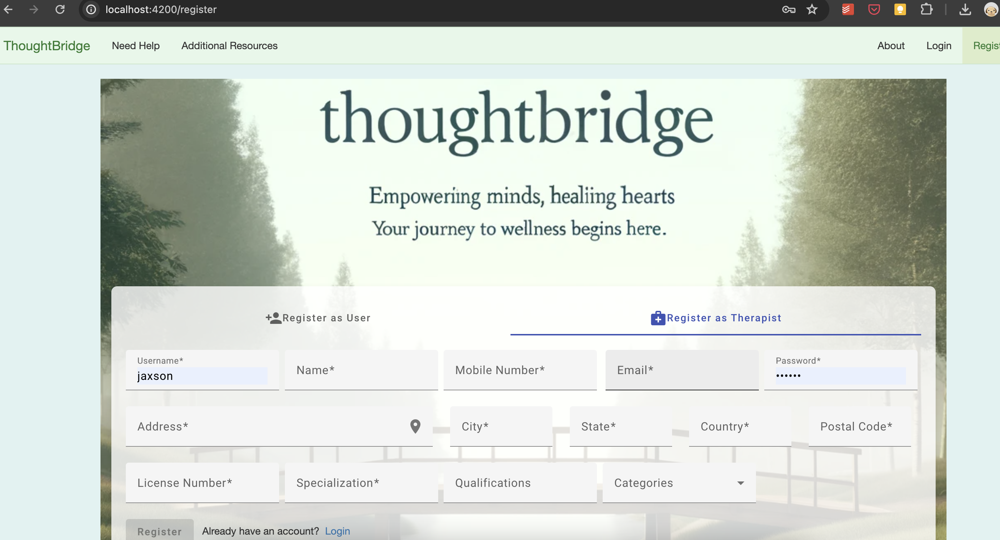
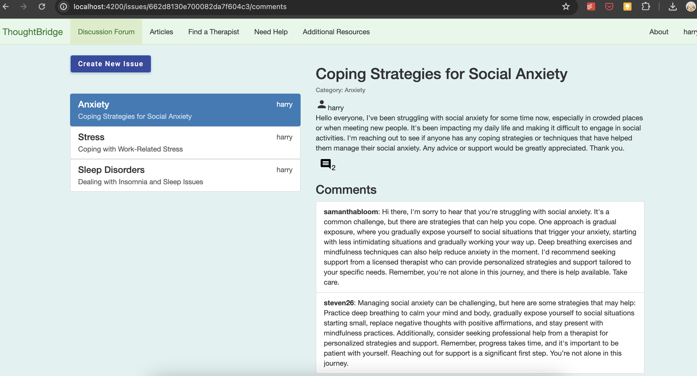
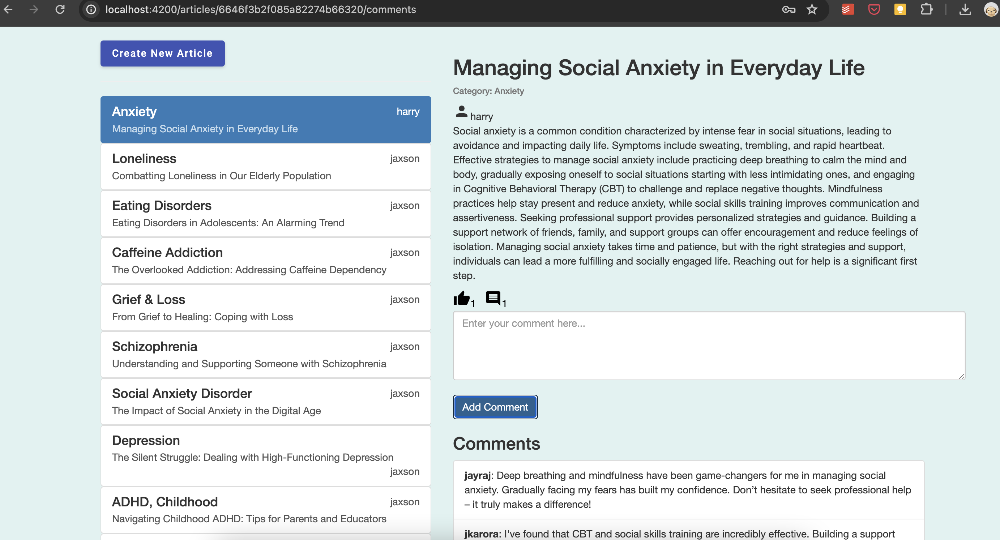
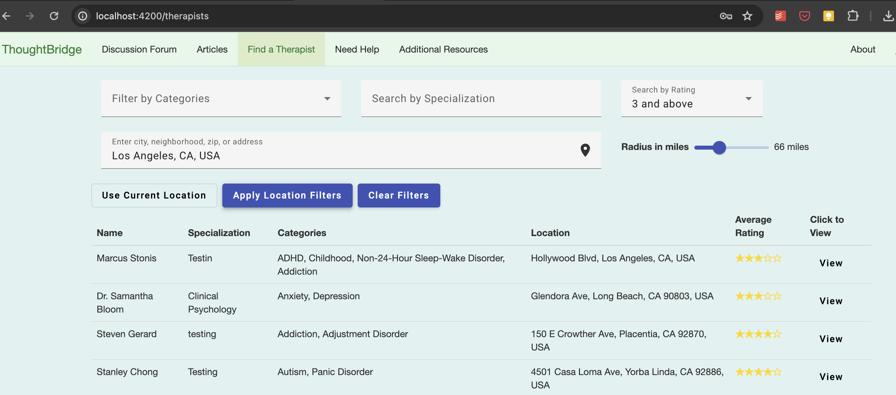
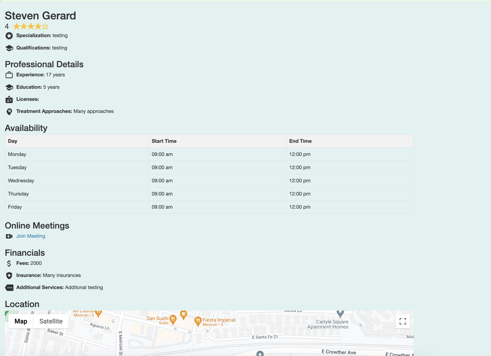
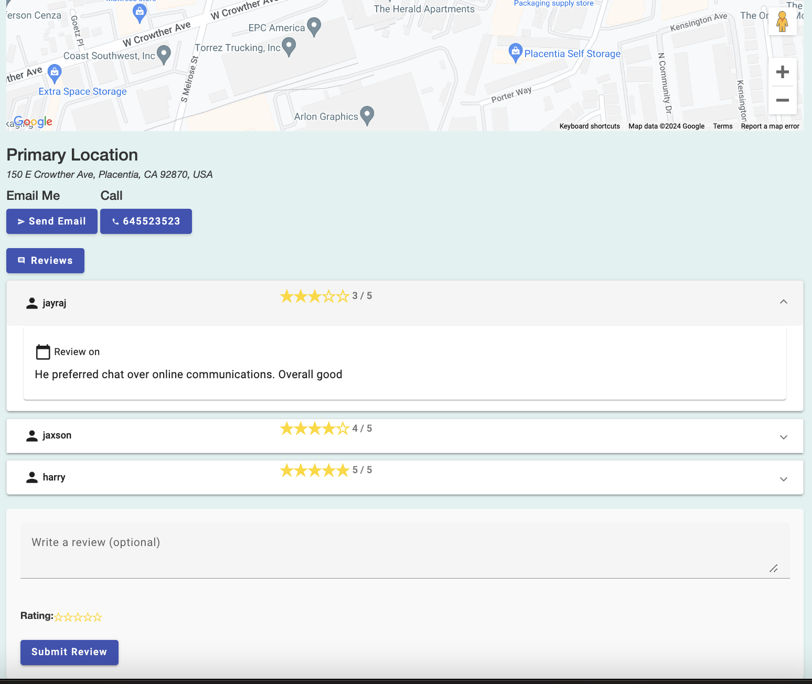
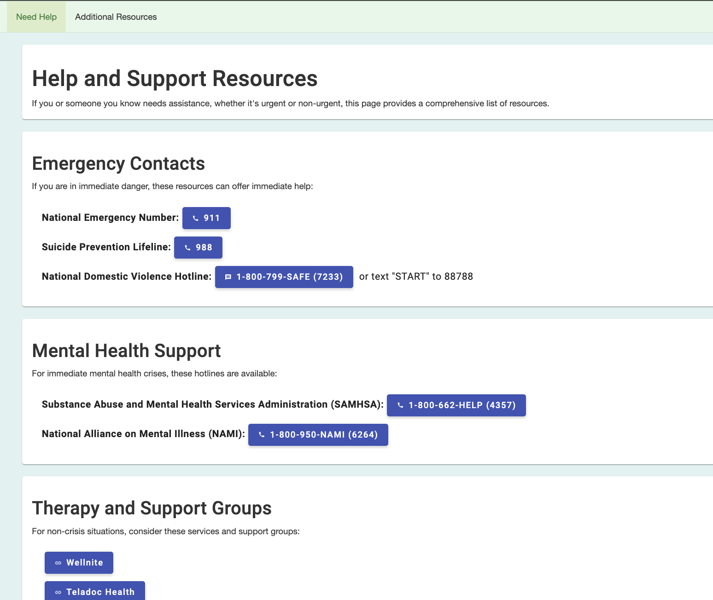

# ThoughtBridge Frontend

ThoughtBridge is a user-friendly platform designed to seamlessly connect individuals with therapists, facilitating easy access to mental health resources. The frontend application offers an intuitive interface for users to browse therapist profiles, participate in discussions, and manage their personal accounts. Built with modern web technologies, ThoughtBridge ensures a responsive and engaging user experience across all devices.
## Tech Stack

- **Angular:** A platform for building mobile and desktop web applications with TypeScript.
- **TypeScript:** A statically typed superset of JavaScript that compiles to plain JavaScript.
- **RxJS:** A library for reactive programming using observables, making it easier to compose asynchronous or callback-based code.
- **Angular Material:** A UI component library for Angular, following the Material Design guidelines.
- **Bootstrap:** A popular front-end framework for building responsive, mobile-first sites.
- **SCSS:** A CSS preprocessor that adds power and elegance to the basic language.
- **Node.js:** A JavaScript runtime built on Chrome's V8 JavaScript engine, used to run the development server.
- **NPM:** A package manager for JavaScript, used to manage dependencies.
## Installation

Before you begin, ensure you have met the following requirements:

### Prerequisites
- **Node.js and npm:** Ensure Node.js and npm are installed by running `node -v` and `npm -v` in your terminal.
- **Angular CLI:** Install Angular CLI globally using `npm install -g @angular/cli`.

### Steps

1. **Clone the Repository:**

   ```bash
   git clone https://github.com/yourusername/thoughtbridge-frontend.git
   cd thoughtbridge-frontend
   ```

2. **Install Dependencies:**
Use npm to install the project dependencies:

```bash
npm install
```

3. **Run the Application:**
Start the Angular development server:

```bash
ng serve
```
The application will start on http://localhost:4200.


## Usage

You can access the ThoughtBridge frontend application in your web browser at `http://localhost:4200`. The application provides the following features:

### Browse Therapist Profiles

- **Search and Filter Therapists:** Use the search bar to find therapists by name or apply filters to narrow down therapists by category of issues tackled, specialization, nearby location or current location, and ratings.
- **View Profiles:** Click on a therapist’s name to view detailed information, including qualifications, experience, contact details, and user reviews.
- **Leave Reviews:** Registered users can leave reviews and ratings for therapists they have consulted with.

### Participate in Discussions

- **Browse Discussions:** Explore various discussion topics related to mental health, categorized by issues, treatments, and advice.
- **Create New Discussion:** Registered users can start new discussions by providing a title, selecting a category, and writing the content.
- **Comment on Discussions:** Engage with the community by posting comments, sharing experiences, and offering support or advice.
- **Upvote Comments:** Upvote helpful comments to highlight valuable contributions from other users.

### User Account Management

- **User Registration:** New users can create an account by providing basic information such as username, email, and password.
- **User Login:** Existing users can log in using their credentials to access personalized features.
- **Profile Management:** After logging in, users can view and update their profile information, including contact details and preferences.
- **Therapist Registration:** Therapists can register by providing additional professional details, such as qualifications, specialization, and availability.
- **Manage Availability:** Therapists can set and update their availability for consultations, making it easier for users to schedule appointments.

## Screenshots

**Home Page**



**Register/Login Page**



**Discussion Forum**



**Articles**



**Therapists Search**



**Therapist Details**




**Emergency Resources**




## Acknowledgements
- [California State University Fullerton](https://www.fullerton.edu/)
- [Angular docs](https://angular.io/docs)
- [AngularMaterial docs](https://material.angular.io/)
- [Bootrap docs](https://getbootstrap.com/docs/4.1/getting-started/introduction/)
- [Udemy course on Angular](https://www.udemy.com/course/the-complete-guide-to-angular-2/learn/lecture/14466438?start=0#overview)


## License

[MIT](https://choosealicense.com/licenses/mit/)

